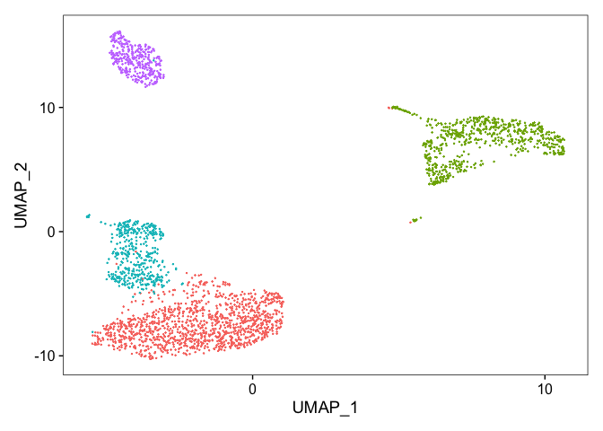
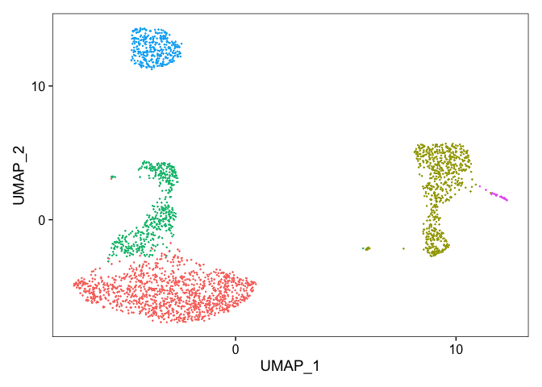

```r
library(clusteringR)
library(dplyr)
#> 
#> Attaching package: 'dplyr'
#> The following objects are masked from 'package:stats':
#> 
#>     filter, lag
#> The following objects are masked from 'package:base':
#> 
#>     intersect, setdiff, setequal, union
library(Seurat)
#> Attaching SeuratObject
library(patchwork)
library(visualisR)
library(ggplot2)
```

# Load data

```r
# Load the PBMC dataset
pbmc <- Read10X(data.dir = "../data/pbmc/")
```

# Clustering

```r
seuratLOG <- clusteringSeurat(datasetObject = pbmc,datasetName = "test",metadataAvailable = F,mapTypeValue = "umap",normalizationMethod = "LOG")
#> Warning: Feature names cannot have underscores ('_'), replacing with dashes
#> ('-')
#> Centering and scaling data matrix
#> PC_ 1 
#> Positive:  MALAT1, LTB, IL32, CD2, ACAP1, STK17A, CTSW, CD247, CCL5, GIMAP5 
#> 	   AQP3, GZMA, CST7, TRAF3IP3, MAL, HOPX, ITM2A, GZMK, MYC, GIMAP7 
#> 	   BEX2, ETS1, LDLRAP1, ZAP70, LYAR, RIC3, TNFAIP8, NKG7, KLRG1, SAMD3 
#> Negative:  CST3, TYROBP, LST1, AIF1, FTL, FCN1, LYZ, FTH1, S100A9, FCER1G 
#> 	   TYMP, CFD, LGALS1, S100A8, CTSS, LGALS2, SERPINA1, SPI1, IFITM3, PSAP 
#> 	   CFP, SAT1, IFI30, COTL1, S100A11, NPC2, LGALS3, GSTP1, PYCARD, NCF2 
#> PC_ 2 
#> Positive:  NKG7, PRF1, CST7, GZMA, GZMB, FGFBP2, CTSW, GNLY, GZMH, SPON2 
#> 	   CCL4, FCGR3A, CCL5, CD247, XCL2, CLIC3, AKR1C3, SRGN, HOPX, CTSC 
#> 	   TTC38, S100A4, ANXA1, IL32, IGFBP7, ID2, ACTB, XCL1, APOBEC3G, SAMD3 
#> Negative:  CD79A, MS4A1, TCL1A, HLA-DQA1, HLA-DRA, HLA-DQB1, LINC00926, CD79B, HLA-DRB1, CD74 
#> 	   HLA-DPB1, HLA-DMA, HLA-DQA2, HLA-DRB5, HLA-DPA1, HLA-DMB, FCRLA, HVCN1, LTB, BLNK 
#> 	   KIAA0125, P2RX5, IRF8, IGLL5, SWAP70, ARHGAP24, SMIM14, PPP1R14A, FCRL2, C16orf74 
#> PC_ 3 
#> Positive:  HLA-DQA1, CD79A, CD79B, HLA-DQB1, HLA-DPB1, CD74, HLA-DPA1, MS4A1, HLA-DRB1, HLA-DRB5 
#> 	   HLA-DRA, HLA-DQA2, TCL1A, LINC00926, HLA-DMB, HLA-DMA, HVCN1, FCRLA, IRF8, BLNK 
#> 	   KIAA0125, SMIM14, PLD4, P2RX5, IGLL5, SWAP70, LAT2, TMSB10, IGJ, MZB1 
#> Negative:  PPBP, PF4, SDPR, SPARC, GNG11, NRGN, GP9, RGS18, TUBB1, CLU 
#> 	   HIST1H2AC, AP001189.4, ITGA2B, CD9, TMEM40, CA2, PTCRA, ACRBP, MMD, NGFRAP1 
#> 	   TREML1, F13A1, RUFY1, SEPT5, MPP1, TSC22D1, CMTM5, RP11-367G6.3, MYL9, GP1BA 
#> PC_ 4 
#> Positive:  VIM, S100A8, S100A6, S100A4, TMSB10, S100A9, IL32, GIMAP7, S100A10, LGALS2 
#> 	   RBP7, MAL, FCN1, LYZ, CD2, S100A12, MS4A6A, FYB, S100A11, AQP3 
#> 	   GIMAP4, FOLR3, ANXA1, MALAT1, AIF1, GIMAP5, IL8, IFI6, TRABD2A, ASGR1 
#> Negative:  HLA-DQA1, HIST1H2AC, PF4, CD79A, SDPR, CD79B, PPBP, GNG11, HLA-DQB1, SPARC 
#> 	   MS4A1, CD74, GP9, HLA-DPB1, RGS18, NRGN, PTCRA, CD9, HLA-DQA2, AP001189.4 
#> 	   CLU, TUBB1, CA2, HLA-DRB1, HLA-DPA1, ITGA2B, HLA-DRA, TCL1A, TMEM40, ACRBP 
#> PC_ 5 
#> Positive:  GZMB, FGFBP2, NKG7, GNLY, PRF1, CCL4, CST7, SPON2, GZMA, GZMH 
#> 	   CLIC3, XCL2, CTSW, TTC38, AKR1C3, CCL5, IGFBP7, XCL1, S100A8, CCL3 
#> 	   TYROBP, HOPX, CD160, HAVCR2, S100A9, FCER1G, PTGDR, LGALS2, RBP7, S100A12 
#> Negative:  LTB, VIM, AQP3, PPA1, MAL, KIAA0101, CD2, CORO1B, CYTIP, FYB 
#> 	   IL32, TRADD, ANXA5, TUBA1B, HN1, PTGES3, TYMS, ITM2A, COTL1, GPR183 
#> 	   ACTG1, TNFAIP8, ATP5C1, TRAF3IP3, GIMAP4, PRDX1, ZWINT, ABRACL, NGFRAP1, LDLRAP1
#> [1] "The best pca to use should be: 10"
#> Warning: The default method for RunUMAP has changed from calling Python UMAP via reticulate to the R-native UWOT using the cosine metric
#> To use Python UMAP via reticulate, set umap.method to 'umap-learn' and metric to 'correlation'
#> This message will be shown once per session

seuratSCT <- clusteringSeurat(datasetObject = pbmc,datasetName = "test",metadataAvailable = F,mapTypeValue = "umap",normalizationMethod = "SCT")
#> Warning: Feature names cannot have underscores ('_'), replacing with dashes
#> ('-')
#> Calculating cell attributes from input UMI matrix: log_umi
#> Variance stabilizing transformation of count matrix of size 12572 by 2700
#> Model formula is y ~ log_umi
#> Get Negative Binomial regression parameters per gene
#> Using 2000 genes, 1000 cells
#> 
  |                                                                            
  |                                                                      |   0%
  |                                                                            
  |==================                                                    |  25%
  |                                                                            
  |===================================                                   |  50%
  |                                                                            
  |====================================================                  |  75%
  |                                                                            
  |======================================================================| 100%
#> Found 99 outliers - those will be ignored in fitting/regularization step
#> Second step: Get residuals using fitted parameters for 12572 genes
#> 
  |                                                                            
  |                                                                      |   0%
  |                                                                            
  |===                                                                   |   4%
  |                                                                            
  |=====                                                                 |   8%
  |                                                                            
  |========                                                              |  12%
  |                                                                            
  |===========                                                           |  15%
  |                                                                            
  |=============                                                         |  19%
  |                                                                            
  |================                                                      |  23%
  |                                                                            
  |===================                                                   |  27%
  |                                                                            
  |======================                                                |  31%
  |                                                                            
  |========================                                              |  35%
  |                                                                            
  |===========================                                           |  38%
  |                                                                            
  |==============================                                        |  42%
  |                                                                            
  |================================                                      |  46%
  |                                                                            
  |===================================                                   |  50%
  |                                                                            
  |======================================                                |  54%
  |                                                                            
  |========================================                              |  58%
  |                                                                            
  |===========================================                           |  62%
  |                                                                            
  |==============================================                        |  65%
  |                                                                            
  |================================================                      |  69%
  |                                                                            
  |===================================================                   |  73%
  |                                                                            
  |======================================================                |  77%
  |                                                                            
  |=========================================================             |  81%
  |                                                                            
  |===========================================================           |  85%
  |                                                                            
  |==============================================================        |  88%
  |                                                                            
  |=================================================================     |  92%
  |                                                                            
  |===================================================================   |  96%
  |                                                                            
  |======================================================================| 100%
#> Computing corrected count matrix for 12572 genes
#> 
  |                                                                            
  |                                                                      |   0%
  |                                                                            
  |===                                                                   |   4%
  |                                                                            
  |=====                                                                 |   8%
  |                                                                            
  |========                                                              |  12%
  |                                                                            
  |===========                                                           |  15%
  |                                                                            
  |=============                                                         |  19%
  |                                                                            
  |================                                                      |  23%
  |                                                                            
  |===================                                                   |  27%
  |                                                                            
  |======================                                                |  31%
  |                                                                            
  |========================                                              |  35%
  |                                                                            
  |===========================                                           |  38%
  |                                                                            
  |==============================                                        |  42%
  |                                                                            
  |================================                                      |  46%
  |                                                                            
  |===================================                                   |  50%
  |                                                                            
  |======================================                                |  54%
  |                                                                            
  |========================================                              |  58%
  |                                                                            
  |===========================================                           |  62%
  |                                                                            
  |==============================================                        |  65%
  |                                                                            
  |================================================                      |  69%
  |                                                                            
  |===================================================                   |  73%
  |                                                                            
  |======================================================                |  77%
  |                                                                            
  |=========================================================             |  81%
  |                                                                            
  |===========================================================           |  85%
  |                                                                            
  |==============================================================        |  88%
  |                                                                            
  |=================================================================     |  92%
  |                                                                            
  |===================================================================   |  96%
  |                                                                            
  |======================================================================| 100%
#> Calculating gene attributes
#> Wall clock passed: Time difference of 15.4273 secs
#> Determine variable features
#> Place corrected count matrix in counts slot
#> Centering and scaling data matrix
#> Set default assay to SCT
#> PC_ 1 
#> Positive:  FTL, CST3, FTH1, TYROBP, LYZ, AIF1, LST1, LGALS1, FCER1G, CTSS 
#> 	   FCN1, S100A9, TYMP, COTL1, S100A6, PSAP, SAT1, S100A4, S100A11, CFD 
#> 	   CD68, OAZ1, S100A8, NPC2, SERPINA1, SPI1, IFITM3, GABARAP, LGALS2, GSTP1 
#> Negative:  RPS27, RPS27A, MALAT1, RPL21, RPL3, RPS3A, RPL9, RPL13A, RPS12, RPS15A 
#> 	   RPSA, RPS6, RPS3, RPS18, RPL13, LDHB, CD3D, RPS13, LTB, RPS14 
#> 	   RPL5, CD3E, RPL32, RPS4X, PTPRCAP, RPS8, IL32, RPL10A, RPL7, RPL10 
#> PC_ 2 
#> Positive:  RPL32, RPL18A, RPL10, RPL13, RPL11, RPS2, HLA-DRA, RPL13A, RPS27, RPS18 
#> 	   CD74, RPLP1, RPS12, CD79A, RPS14, RPS5, HLA-DQA1, RPS16, RPS9, HLA-DQB1 
#> 	   HLA-DPB1, RPS6, RPS13, HLA-DRB1, RPL19, RPL10A, RPL18, CD37, MS4A1, RPS8 
#> Negative:  NKG7, GZMB, PRF1, CST7, GZMA, GNLY, FGFBP2, CTSW, B2M, SPON2 
#> 	   HLA-C, CCL5, CCL4, GZMH, CD247, GZMM, KLRD1, CLIC3, HLA-A, XCL2 
#> 	   AKR1C3, S1PR5, TTC38, HOPX, APMAP, PRSS23, IGFBP7, TPST2, GPR56, FCGR3A 
#> PC_ 3 
#> Positive:  NKG7, PRF1, GZMA, CST7, GNLY, CTSW, FGFBP2, S100A4, GZMB, CCL4 
#> 	   SPON2, S100A6, TYROBP, GZMM, CD247, ID2, GZMH, HCST, IGFBP7, KLRD1 
#> 	   ITGB2, LGALS1, PFN1, ANXA1, S100A11, CYBA, S100A9, FCN1, LYZ, S100A10 
#> Negative:  GP9, AP001189.4, LY6G6F, ITGA2B, TMEM40, PF4, GNG11, SDPR, PTCRA, TREML1 
#> 	   SPARC, CLDN5, PPBP, SEPT5, CLU, HGD, ITGB3, CMTM5, C2orf88, RP11-879F14.2 
#> 	   HIST1H2AC, TUBB1, SCGB1C1, NRGN, GP1BA, ACRBP, RGS18, CLEC1B, CD9, CA2 
#> PC_ 4 
#> Positive:  LDHB, CD3D, CD3E, IL7R, RPS14, NOSIP, JUNB, RPS12, RGS10, TMSB4X 
#> 	   VIM, FYB, IL32, NGFRAP1, ZFP36L2, GIMAP7, RGCC, RPS3, GIMAP4, MAL 
#> 	   RPL32, CD2, TPT1, AQP3, S100A4, TCF7, FOS, TMEM66, FLT3LG, S100A6 
#> Negative:  CD74, CD79A, CD79B, HLA-DRA, HLA-DQA1, MS4A1, HLA-DQB1, HLA-DPB1, TCL1A, HLA-DRB1 
#> 	   HLA-DPA1, LINC00926, CD37, VPREB3, HLA-DQA2, HLA-DRB5, BANK1, FCER2, HLA-DMA, FCRLA 
#> 	   HVCN1, HLA-DMB, TSPAN13, HLA-DOB, EAF2, CD72, SPIB, PKIG, BLNK, GNG7 
#> PC_ 5 
#> Positive:  S100A8, S100A9, LYZ, GPX1, LGALS2, CD14, GSTP1, MS4A6A, FOLR3, BLVRB 
#> 	   CSF3R, GRN, CEBPD, S100A12, GAPDH, VCAN, QPCT, ID1, ALDH2, RBP7 
#> 	   ASGR1, RNASE6, AP1S2, CCL3, PLBD1, BST1, CLEC4E, MGST1, TSPO, NCF1 
#> Negative:  FCGR3A, MS4A7, IFITM2, RHOC, RP11-290F20.3, CKB, CDKN1C, RPS19, SIGLEC10, LST1 
#> 	   HMOX1, LRRC25, IFITM3, LILRA3, VMO1, FCER1G, PILRA, TIMP1, CTD-2006K23.1, HCK 
#> 	   LYPD2, COTL1, CEBPB, FAM110A, SERPINA1, AIF1, PPM1N, WARS, ADA, LILRB2
#> [1] "The best pca to use should be: 10"
```

# Visualize clustering data

```r
drawDimPlot(seuratObject = seuratLOG,datasetName = "pbmc")
```

<!-- -->

```r
drawDimPlot(seuratObject = seuratSCT,datasetName = "pbmc")
```

<!-- -->


